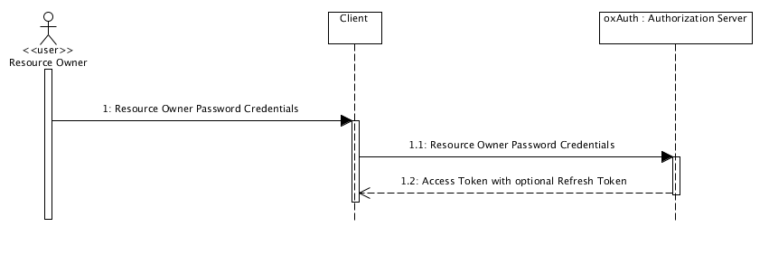
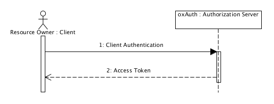
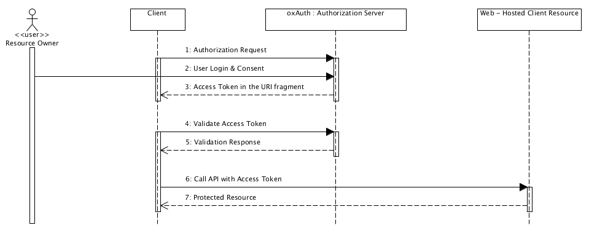
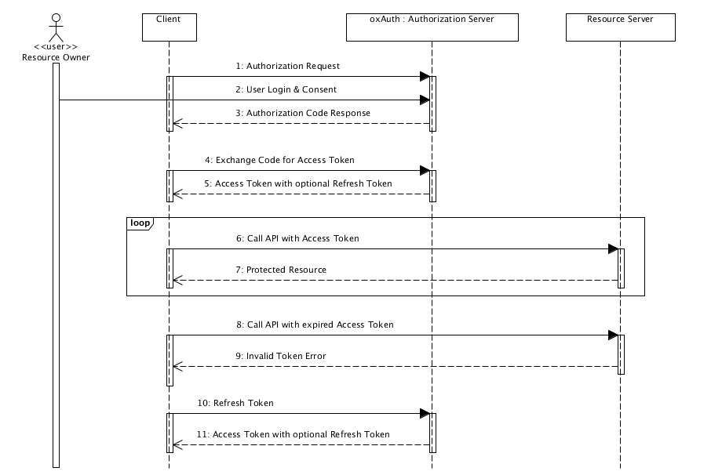

회사에서 프로젝트를 진행하며 Oauth에 대한 종류에 대해서 공부한것을 정리할려고 합니다.

크게 4종류만 소개하고 
refreshToken과 device는 제외하고 진행합니다.
또한 개인적인 블로그 글이며 기초적인 글은 생략되고 진행될수 있음을 말씀드립니다. 

<br/>

## OAuth

### Resource Owner Password Credentials Grant Type (리소스 소유자 암호 자격 증명 타입)

 * Client에 아이디/패스워드를 받아 아이디/패스워드로 직접 access token을 받아오는 방식이다.
 * Client가 신용이 없을 때에는 사용하기에 위험하다는 단점이 있다. 
 * 클라이언트가 확실한 신용이 보장될 때 사용할 수 있는 방식이다.



<!-- 
```javascript
['a', 'b', 'c'].includes('a') // true
```

코드를 보면 쉽게 역할을 알 수 있습니다.
배열에 아이템이 존재하는지 Boolean 값을 반환합니다.

이 함수로 이제 `['a','b','c'].indexOf('a') > -1` 대신 좀 더 간결한 코드가 가능합니다. -->

### Client Credentials Grant Type (클라이언트 자격 증명 타입)

 * 애플리케이션이 Confidential Client일 때 id와 secret을 가지고 인증하는 방식이다. (기존 서버 방식)

 

### Implicit Grant (암시적 승인)
 
 * Public Client인 브라우저 기반의 애플리케이션(Javascript application)이나 모바일 애플리케이션에서 바로 Resource Server에 접근하여 사용할 수 있는 방식이다.

 


### Authorization Code Grant (권한 부여 코드 승인 타입)

 * 일반적인 웹사이트에서 소셜로그인과 같은 인증을 받을 때 가장 많이 쓰는 방식으로 
   기본적으로 지원하고 있는 방식이다.

 