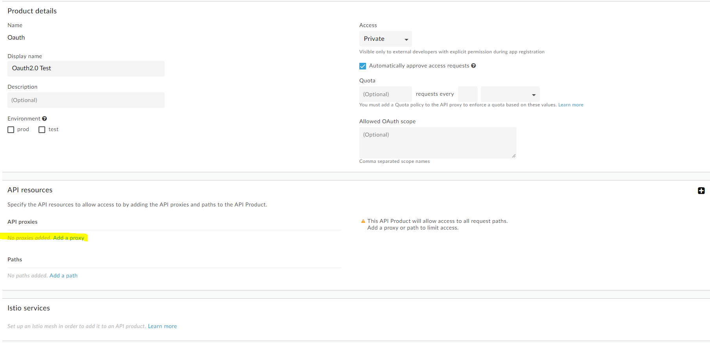
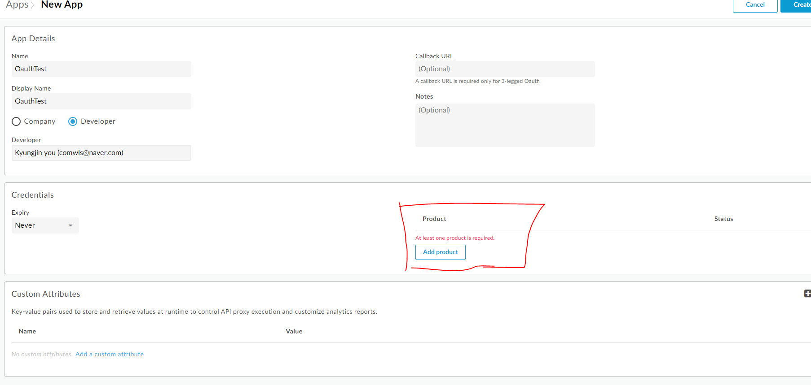
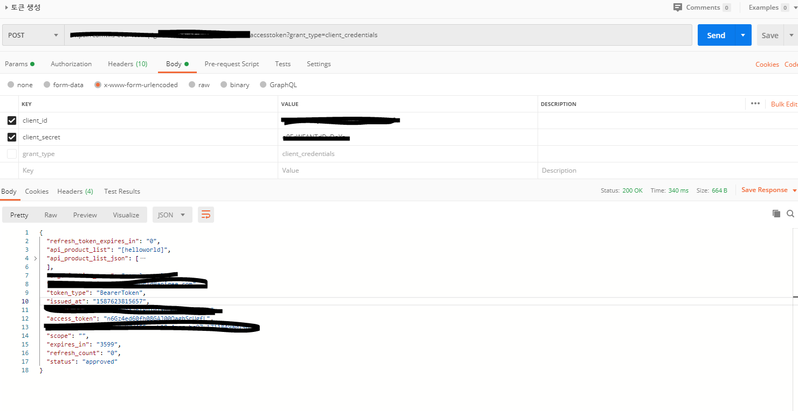

이글은 개인적인 블로그 글이며 기초적인 글은 생략되고 진행될수 있음을 말씀드립니다. 

 

## apigee 란
 apigee(아피지,애피지)란 GCP(Google Cloud Platform)의 API Gateway로 
 GCP와 상관 없는 다른 엔드포인트를 호출해서 사용할수 있다.

## apigee 시작하기

 ### apigee 가입하기 [무료 평가판](https://cloud.google.com/apigee/api-management?hl=ko)
  - 무료평가판은 60일 유지
  - 카드 정보를 입력할 필요 없음
  - 한달 기준 10만건 호출 가능

 ### apigee 프로젝트 만들기
  #### API Proxies
   - URL endpoint 지점 
   - 배포 환경은 test, production 두가지가 존재 한다.
   - 배포 환경별로 URL이 바뀐다.

  #### API Products
   - API Proxy를 묶는 그룹단위 개념 
  
  #### Apps 
   - ClientId랑 ClientSecret이 발급되는곳 
   - Proudct를 Apps에 추가해주면 해당 키,토큰 값들이 이곳에 묶인다.

 ### OAuth 토큰 발급 프록시 만들기 
   - [예시 토큰 번들 다운](https://github.com/apigee/api-platform-samples/blob/master/default-proxies/oauth/oauth.zip?raw=true)
   - 프록시 생성 버튼을 누른다.
   - Upload proxy bundle 누른다
   - 다운받은 예시 번들을 업로딩 한다
   - 해당 URL에 /accesstoken  추가하여 POST 타입으로 데이터 전송하면 토큰이 발급예정( 아직 clinetId랑 시크릿이 없어서 발급안됨 )

 ### OAuth 토큰 미들웨어 만들기
   - 프록시 생성 버튼을 누른다.
   - Reverse proxy (most common) 을 선택 한다.
   - Existing API에  http://mocktarget.apigee.net 추가하고
   - 다음을 누른후 Security 항목에 OAuth 2.0을 선택하고 next룰 누른다.
   - Virtual Host 항목에 secure를 선택한다.
   - Optional Deployment에 prod(production), test 룰 선택한다.
   
   
 ### API Proxies 를 Product에 추가한다
  - 좌측 항목에 Publish안에 API Proudcts를 선택한다.
  - Name, Display 항목에 내용을 채우고 아래 API resources 항목에 API proxies 항목에 Add a proxy를 선택한다.
  - 전에 만든 토큰만들기, 토큰 미들웨어 프록시 항목을 추가하고 저장한다.
  

 ### Apps를 이용하여 키 발급하기 ( Client_Id, Client_Secret)
 - 좌측 항목에 Publish 안에 Apps를 선택한다.
 - Name, Display Name 을 채우고 Credntials 항목에 키값의 시간을 정한다
 - 해당 우측에 Product 항목에 Add product를 누른다.
 
  
  
 - Product를 발급하고 Restful Tool(ex:postman) 을 이용하여 발급받은 key, secret 항목을 넣어서 토쿤이 정상 발급되는지 테스트 해보면 된다.
 
  
   

참조

[구글doc OAuth 기능 붙이기](https://docs.apigee.com/api-platform/tutorials/secure-calls-your-api-through-oauth-20-client-credentials?hl=ko)

